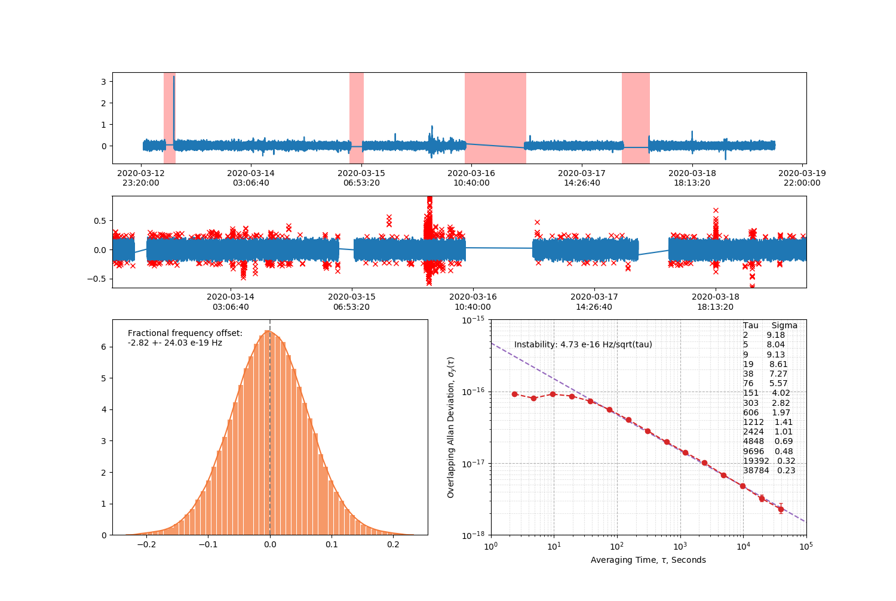

# Stable32-AllanTools

Handy graphical user interface to quickly visualize and clean data before calculating Allan deviations. Perfect in the field of frequency metrology to analyze the stability of a system. This script is a port of the free Stable32 software, and gives the same confidence intervals. 

Chunks of valid data to be analyzed can be selected interactively via the GUI by drawing rectangle selectors over regions of invalid data. An outlier's detection algorithm is then applied to the filtered data to further improve robustness.

Statistics are calculated live on the cleaned data i.e. the data selected interactively and with outliers removed.

